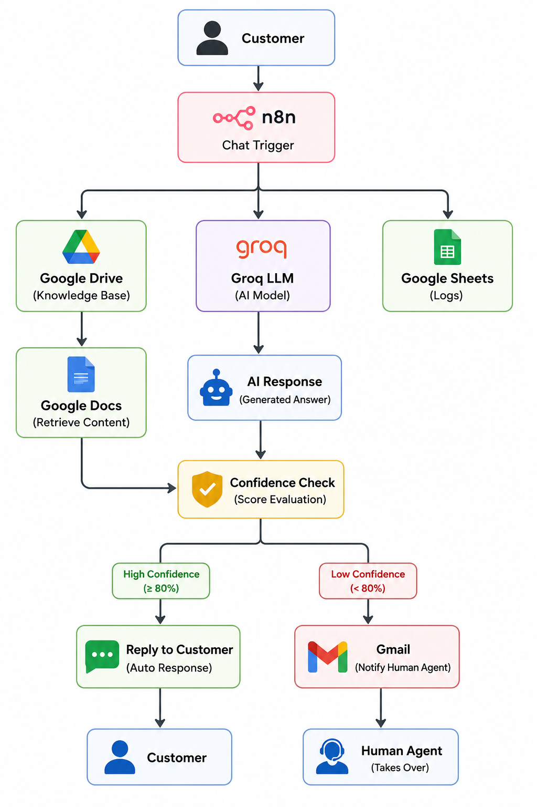

# AI-Powered Customer Support Automation using n8n, Groq & Claude Code

---

# Overview

An **AI-Powered Customer Support Automation System** developed using **n8n Workflow Automation**, **Groq Llama 3.3**, and **Retrieval-Augmented Generation (RAG)** to automate customer query resolution. The system retrieves company-specific information from a Google Docs knowledge base, generates AI-powered responses, performs confidence-based decision making, and automatically escalates unresolved queries to human support agents through Gmail while maintaining conversation logs.

---

# Business Problem

Customer support teams spend significant time answering repetitive customer queries, resulting in increased operational costs, delayed response times, inconsistent customer experiences, and higher dependency on manual support agents. Businesses require an intelligent automation solution that can instantly resolve common questions while ensuring complex issues are handled efficiently by human representatives.

---

# Solution

Developed an **Agentic AI Customer Support Workflow** using **n8n**, **Groq Llama 3.3**, **Google Drive**, **Google Docs**, **Google Sheets**, and **Gmail**. The workflow retrieves relevant information from a centralized knowledge base, generates AI-powered responses using **Retrieval-Augmented Generation (RAG)**, evaluates response confidence, automatically replies to customers for high-confidence queries, and generates support tickets with Gmail notifications for low-confidence cases.

---

# Key Features

- AI-Powered Customer Support Automation
- Workflow Automation using n8n
- Google Drive Knowledge Base Retrieval
- Confidence-Based Decision System
- Automated Customer Response Generation
- Gmail Ticket Generation
- Human Escalation Workflow
- Google Sheets Conversation Logging
- API & Webhook Integration

---

# System Architecture

The system integrates **n8n**, **Google Drive**, **Google Docs**, **Groq Llama 3.3**, **Google Sheets**, and **Gmail** to retrieve knowledge, generate AI-powered responses, evaluate confidence, automate customer replies, and escalate unresolved queries to human support agents.

---

# Workflow

Customer queries are received through the **n8n Chat Trigger**, matched against the **Google Docs knowledge base**, processed by **Groq Llama 3.3**, evaluated using a confidence score, and either answered automatically or escalated to a human support agent while logging all interactions.

---

# Technology Stack

| Category | Technology |
|----------|------------|
| Workflow Automation | n8n |
| AI Model | Groq Llama 3.3 70B |
| AI Architecture | Retrieval-Augmented Generation (RAG) |
| Knowledge Base | Google Drive + Google Docs |
| Workflow Trigger | n8n Chat Trigger |
| Notifications | Gmail API |
| Logging | Google Sheets |
| APIs | Google Workspace APIs |
| Development Style | Low-Code Automation |

---

# Gmail Ticket Generation

When the AI confidence score falls below **80%**, the workflow automatically generates a unique support ticket containing the customer query, AI draft response, confidence score, session details, and timestamp, then sends it to the assigned support agent through **Gmail** for manual resolution.

---

# Future Enhancements

- Multi-Agent AI Architecture
- WhatsApp Business API Integration
- Slack & Microsoft Teams Integration
- Multi-Language AI Support
- Voice-Based Customer Support
- AI Analytics Dashboard using Power BI
- Automatic Follow-Up Email Automation
- Real-Time Customer Satisfaction (CSAT) Analysis
- Predictive Support Insights using AI

